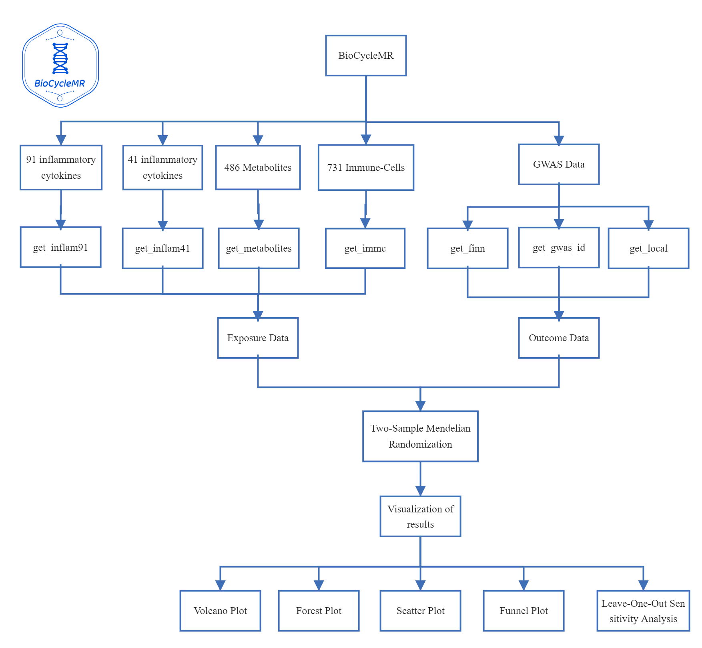
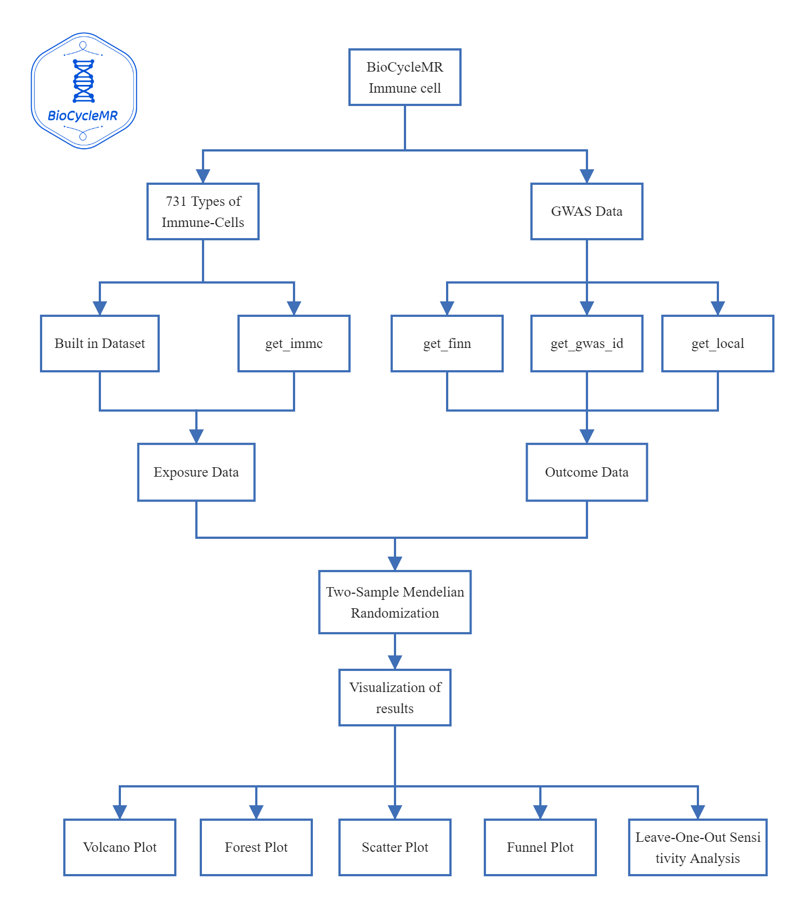

{width="423"}

# Introduction🎯

`BioCycleMR` is an R package crafted with the objective of enhancing Mendelian Randomization (MR) analysis in the field of biomedical research. Designed to integrate diverse exposure data types, the tool is an amalgamation of traditional medicinal insights and the dynamism of modern genomics.🌱

# Installation🎉

### Installing the Package

``` r
install.packages("devtools")
devtools::install_github("DaXuanGarden/BioCycleMR")
```

### Load and Commence

``` r
library(BioCycleMR)
results <- runBioCycleMR(your_exposure_data, your_outcome_data)
print(results)
```

# Detailed Function Descriptions📕

{width="518"}

## get_finn

### Usage:

To process FINN data from the "finn" directory and save the results to "finn_r" using `64cores`:

``` r
library(BioCycleMR)
get_finn(finn_dir = "finn", save_dir = "finn_r", cores = 64)
```

### Parameters:

1.  `finn_dir` (default: "finn"):
    -   Description: Specifies the directory where the raw FINN data files are located.
    -   Type: String
2.  `save_dir` (default: "finn_r"):
    -   Description: Directory where the processed results should be saved.
    -   Type: String
3.  `cores` (default: 64):
    -   Description: Number of cores to be used for parallel processing.
    -   Type: Integer

------------------------------------------------------------------------

Please note that this is a fictional guide based on the function details you provided. For real-world usage and accurate documentation, consult the actual package's documentation or its GitHub repository.

## Immune cells



1.  **Retrieve Data for 731 Immune Cells**

    Obtain data for 731 immune cells. Choose to use preprocessed data or customized parameters (we have used the built-in default parameter `p1 = 1e-05`). The network problem can be solved well using this function, where we use the parameter `count_try_max` to adjust the maximum number of network attempts

    ``` r
    immc_data_preprocessed <- get_immc(use_preprocessed = TRUE)
    immc_data_custom <- get_immc(use_preprocessed = FALSE, 
                                 p1 = 1e-05, 
                                 p2 = 5e-08, 
                                 r2 = 0.001, 
                                 kb = 10000, 
                                 mc_cores = 10)
    ```

    In order to avoid the problem of poor network of some users, we have been prepared to mess with the exposure data of the immunophenotypes with `p=1e-5` and `p=5e-6`

    ``` r
    data("immune_cell_raw1e5")
    data("immune_cell_raw5e6")
    ```

2.  **Preprocess FinnGen R9 Data**

    We recommend that you preprocess FinnGen R9 Data into a format with the suffix `.rda` (You will need to place the files downloaded from the [FinnGen R9 Data](https://www.finngen.fi/en/access_results) in the specified directory).

    ``` r
    get_finn(finn_dir = "finn", save_dir = "finn_r", cores = 30)
    ```

3.  **Retrieve GWAS Datasets Using Keyword or ID**

    Identify potential genetic instruments for MR analysis using keywords or IDs.

    ``` r
    get_gwas_id("Myocardial infarction")
    get_gwas_id("finn-b-N14_ENDOMETRIOSIS")
    ```

4.  **Convert Local VCF File for Two-Sample MR Analysis**

    Convert VCF files for MR studies.

    ``` r
    get_local("ieu-a-2.vcf.gz", "exposure")
    ```

5.  **Calculate F-values and MAF**

    Estimate F-statistics and minor allele frequency for MR studies.

    ``` r
    data("dx_immu_cell_raw_df")
    result_list <- get_f_maf(dat_object = immu_cell_raw,F_value = 10,maf_threshold = 0.01,)
    immu_cell_f = result_list[[1]],
    immu_cell_f_select = result_list[[2]],
    SNP_stats_f = result_list[[3]]
    ```

6.  **Complex Operations with `get_tsmr`**

    The code below will create folders and output the results of MR, heterogeneity, horizontal pleiotropy, and PRESSO level pleiotropy tests

    ``` r
    get_tsmr(immu_cell_f_select, finn_r_dir="finn_r", cores = 64)
    ```

7.  **Compute Effect Size Estimates from `.rda` Files**

    Derive effect size metrics from .rda files.

    ``` r
    get_effect("~/path_to_directory", immune_ref_data)
    ```

# Future Developments🐾

`BioCycleMR` is designed with adaptability and scalability in mind. While it stands as a reflection of the current knowledge and skills of its creators, they envisage it to evolve, incorporating advancements in biomedical research and feedback from the scientific community.

# Community Engagement and Feedback👏🏻

Open communication channels and collaborations are the lifeblood of `BioCycleMR`. The creators earnestly invite the community to pitch in, share insights, suggest enhancements, or even critique -- every interaction is a step towards refinement.

# Creators😊

-   **Xuanyu Wang**: Xuanyu Wang, a 2021 undergraduate student from College of Traditional Chinese Medicine, Tianjin University of Traditional Chinese Medicine. Research Interests in Traditional Chinese Medicine with a special focus on Cardiology and Cardiovascular diseases.

-   **Yangyang Zhang**: A 2021 undergraduate student from Shanghai Medical College, Fudan University. Research Interests include Obstetrician-gynecology, and reproductive medicine.

# Contact✍🏻

For discussions, feedback, or potential collaborations:

📧 [Xuanyu Wang(DaXuanGarden)](mailto:daxuan111000@163.com) 📧 [Yangyang Zhang (pigudogzyy)](mailto:pigudogzyy@gmail.com)
