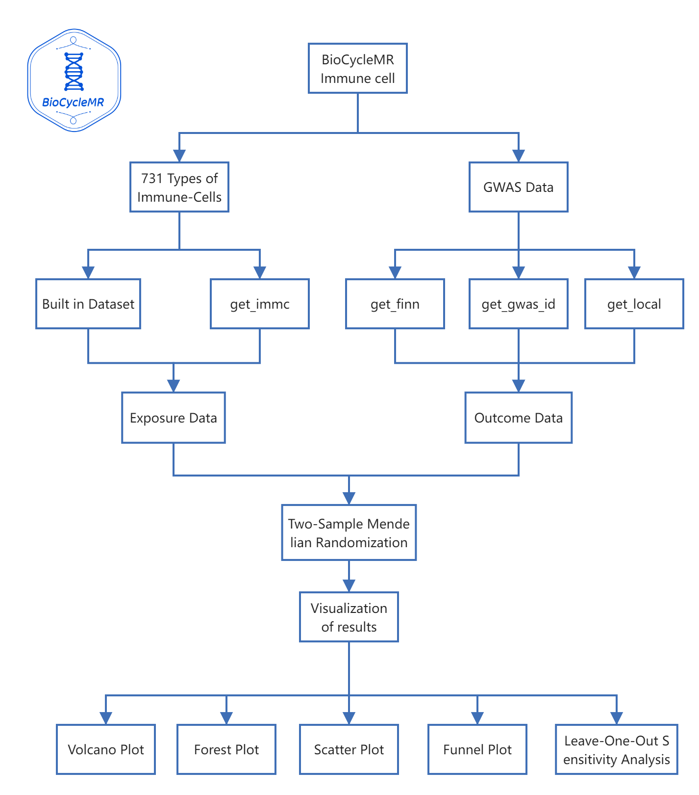

# BioCycleMR


## Introduction

`BioCycleMR` is an R package crafted with the objective of enhancing Mendelian Randomization (MR) analysis in the field of biomedical research. Designed to integrate diverse exposure data types, the tool is an amalgamation of traditional medicinal insights and the dynamism of modern genomics.

## Installation and Usage

### Installing the Package

``` r
install.packages("devtools")
devtools::install_github("DaXuanGarden/BioCycleMR")
```

### Load and Commence

``` r
library(BioCycleMR)
results <- runBioCycleMR(your_exposure_data, your_outcome_data)
print(results)
```

### Detailed Function Descriptions

#### Immune cells



1.  **Retrieve Data for 731 Immune Cells**

    Fetch data for 731 immune cells. Choose between using preprocessed data or custom parameters.

    ``` r
    immc_data_preprocessed <- get_immc()
    immc_data_custom <- get_immc(use_preprocessed = FALSE, p1 = 5e-5, mc_cores = 15)
    ```

2.  **Harmonize and Process FinnGen R9 Data**

    Harmonizes the FinnGen R9 dataset.

    ``` r
    get_finn(finn_dir = "finn", save_dir = "finn_r", cores = 30)
    ```

3.  **Retrieve GWAS Datasets Using Keyword or ID**

    Identify potential genetic instruments for MR analysis using keywords or IDs.

    ``` r
    get_gwas_id("Myocardial infarction")
    get_gwas_id("finn-b-N14_ENDOMETRIOSIS")
    ```

4.  **Convert Local VCF File for Two-Sample MR Analysis**

    Convert VCF files for MR studies.

    ``` r
    get_local("ieu-a-2.vcf.gz", "exposure")
    ```

5.  **Calculate F-values and MAF**

    Estimate F-statistics and minor allele frequency for MR studies.

    ``` r
    immu_cell_f_select <- get_f_maf(dat_object = immu_cell_raw)
    ```

6.  **Complex Operations with `get_tsmr`**

    Engage in intricate MR procedures.

    ``` r
    get_tsmr(immu_cell_f_select, finn_r_dir, cores = 64)
    ```

7.  **Compute Effect Size Estimates from .rda Files**

    Derive effect size metrics from .rda files.

    ``` r
    get_effect("~/path_to_directory", immune_ref_data)
    ```

## Future Developments

`BioCycleMR` is designed with adaptability and scalability in mind. While it stands as a reflection of the current knowledge and skills of its creators, they envisage it to evolve, incorporating advancements in biomedical research and feedback from the scientific community.

## Community Engagement and Feedback

Open communication channels and collaborations are the lifeblood of `BioCycleMR`. The creators earnestly invite the community to pitch in, share insights, suggest enhancements, or even critique -- every interaction is a step towards refinement.

## Creators

-   **Xuanyu Wang**: Xuanyu Wang, a 2021 undergraduate cohort from Tianjin University of Traditional Chinese Medicine, majors in Traditional Chinese Medicine with a special focus on Cardiology and Cardiovascular diseases. Xuanyu delves into the intricate interrelations between cardiovascular and cerebrovascular maladies, aiming to decipher the underlying genetic and molecular mechanisms linking these two critical systems. With a keen interest in marrying age-old medical wisdom with modern genetic research, Xuanyu Wang plays a pivotal role in molding the core of `BioCycleMR`.

-   **Yangyang Zhang**: A part of the 2021 undergraduate batch, Yangyang Zhang is majoring in Clinical Medicine at Fudan University. His primary research interest lies in reproductive medicine. Zhang's endeavors encapsulate understanding the genetic underpinnings of fertility, delving into the molecular complexities of embryonic development, and probing the role of epigenetics in reproductive health. In addition, his work extends to exploring assisted reproductive technologies and their bearing on the wider realm of human health. Zhang's expertise and zeal for eQTL and immune cell data significantly bolster the capabilities of the package.

## Contact

For discussions, feedback, or potential collaborations:

📧 [Xuanyu Wang](mailto:daxuan111000@163.com) 📧 [Yangyang Zhang (pigudogzyy)](pigudogzyy@gmail.com)
